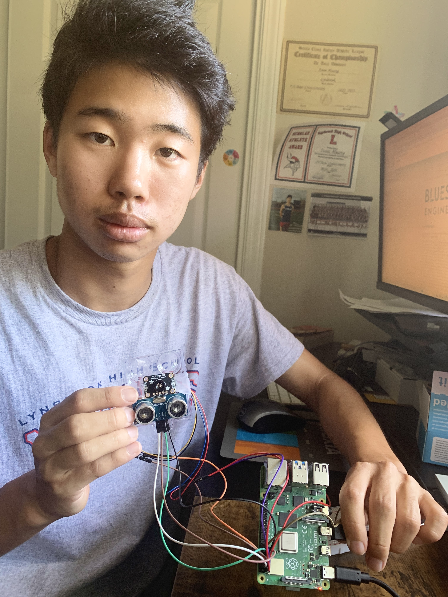
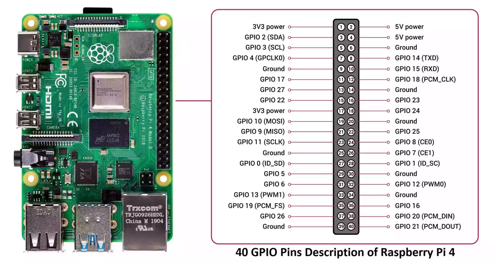
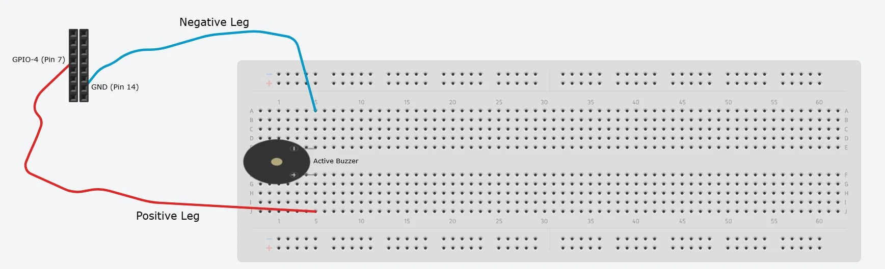
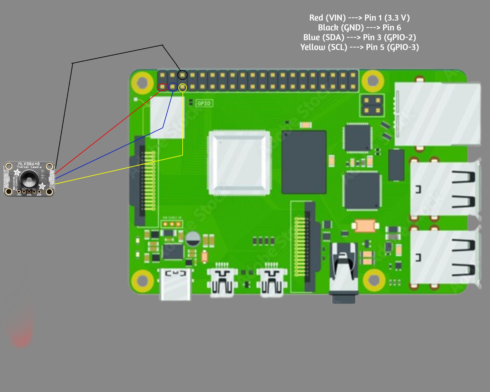

# Isaac's Project
For my project, I built a thermal camera system powered by the Raspberry Pi 4 that can create heatmaps, measure distances, and even trigger an alarm when temperatures rise too high. One of the most difficult challenges I was met with was installing and configuring the necessary software and modules but that made my first successful heatmap display even more rewarding. Developing this project strengthened persistence, creativity, and problem-solving skills while transforming my ideas into a functioning tool with real-world potential.

| **Engineer** | **School** | **Area of Interest** | **Grade** |
|:--:|:--:|:--:|:--:|
| Isaac H | Lynbrook | Electrical Engineering | Senior


  
# Final Milestone

<iframe width="560" height="315" src="https://www.youtube.com/embed/F7M7imOVGug" title="YouTube video player" frameborder="0" allow="accelerometer; autoplay; clipboard-write; encrypted-media; gyroscope; picture-in-picture; web-share" allowfullscreen></iframe>

I am so happy to be have put on the finishing touches and modifications on my thermal camera project. This week was mostly spent on preparing for demo night on Thursday but it was accompanied with moments of creativity. In addition to fixing a few bugs here and there, my two main modifications to wrap up the project for the **active buzzer** used for **overheating detection** and a **distance-from-object** display on matplotlib. I found the buzzer to be the simpler modificationas it only involved plugging the buzzer onto a breadboard and linking it with the Raspberry Pi with two male-to-female wires. Although I constructed my circuit in an unconventional manner, the buzzer works as normal and is completely safe to use. When put into use, the buzzer will release a sound whenever the detected temperatures exceed the threshold set at 50 degrees Celsius, the same time as the warning text message I added in the previous milestone. The distance-from-object display modifications was more challenging. At first, I considered using formulas I found onlien to approximate the distance between the sensor and an object. However, I quickly realized this approach would not be very accurate. Instead, I decided on using an ultrasonic sensor, the HC-SR04, that could measure distances more accurately. In addition to using the GND and 5V power pins, the sensor uses two singla pins: "Trig" and "Echo". Trig and Echo correspond to Pin 11 and Pin 12, or GPIO-17 and GPIO-18, on the Raspberry Pi respectively. The Trig pin emits ultrasonic pulses out into the surrounding area. The Echo pin is responsible for receiving the reflected pulse and outputting a signal duration. Since the MLX90640 and HC-SR04 are two separate devices, I needed to combine them both into a single body. I did this by cutting off part of the "blister pack" packaging from the HC-SR04s. I then used the piece I cut off and repurposed it into a holder for both sensors. This allowed them to sit as close as possible, ensuring that distance measurements aligned accurately with the thermal camera's readings.

Looking back on the past three weeks at BlueStamp, my biggest challenge came early on: installing the necessary software modules and packages to get the Raspberry Pi and MLX90640 working together. At first, I thought simply connecting the pins would be enough, but I quickly discovered that I needed to install multiple libraries and configure settings for programming, data display, and remote machine connection. This process was frustrating and time-consuming, but it also forced me to troubleshoot independently, learn how to navigate technical documentation, and persist through trial and error.

That being said, my biggest triumph was getting the display on my monitor. After days of troubleshooting, I fully expected another error message when I was trying out matplotlib display for the first time. But when I ran the code, the display worked instantly---the heatmap appeared along with a colorbar, axes, and accurate temperature readings. That moment was incredibly rewarding and it reminded me of the resilience I had built throughout the process.

After everything I have learned at BlueStamp Engineering, I hope to go deeper into areas that will help me develop ideas to transform my projects into real-life applicable tools. To me, engineering is not just about completing a program, but about creating technology that has both personal and practical impact. I also hope to strengthen my understanding of signal processing and data analysis, since being able to filter and interpret sensor data more effectively can open up new applications. Finally, I want to continue engaging in programs like to BlueStamp that will further develop my design and innovation skills---so I can take an idea from concept all the way to a finished product.

# Second Milestone

<iframe width="560" height="315" src="https://www.youtube.com/embed/8L5X5QeWMsU?si=WBIwCxjCGzkEGTfJ" title="YouTube video player" frameborder="0" allow="accelerometer; autoplay; clipboard-write; encrypted-media; gyroscope; picture-in-picture; web-share" referrerpolicy="strict-origin-when-cross-origin" allowfullscreen></iframe>

My goal for Milestone 2 was at least getting the bare minimum done---that was, connecting my camera sensor and Raspberry Pi together and getting live heatmaps displayed on my monitor. After that, I planned to add some elementary modifications that would mainly improve user interface and performance.  There was a specific way the MLX90640 and the Pi had to be connected for the whole system to work. Using an online diagram as my reference (I will also put it on the bottom of the page), I learned about the 40 different GPIO pins on the Raspberry Pi 4. Pins 1 and 2 (from the top) were the power pins (3.3V and 5V outputs), which would supply the voltage and current needed for the circuit to continue running. I used the 3.3 V power because the Adafruit MLX90640 normally operates at 3.3 V (using 5 V could permanently dammage the sensor). I then used GPIO 2 (SDA), labeled as Pin 3, and GPIO 3 (SCL) labeled as Pin 5, to enable I2C communication. The last pin I used was the GND or ground pin, labeled Pin 6, which acts as a return to the power supply.

I successfully integrated the Adafruit MLX90640 with the Raspberry Pi with the help of the STEMMA QT/Qwiic cable and female jumper wires. It was important to match the correct wires with the correct pins otherwise the sensor would not activate. 
It goes:

Red (VIN) ---> Pin 1 (3.3 V)

Black (GND) ---> Pin 6

Blue (SDA) --->	Pin 3 (GPIO 2)*

Yellow (SCL) --->	Pin 5 (GPIO 3)*

*these two pins are interchangeable

I then had to enable X11 Forwarding, a feature of the SSH protocol that allowed me use my remote server to display the image on my monitor. I also installed matplotlib on Python, a library capable of creating animated images and viualizations. In my code, I also used the modules board and busio. The board module essentially creates a bridge between my code on the physical pins on the Raspberry Pi. The busio module is responsible for handling the I2C protocol connections which as what will let me communicate with the MLX90640 camera sensor. So far, most of the live display code is identical to what was provided in the original script. I added a few modifications improve user interface such as numerical temperature readings from the center pixel, an overheat warning, and a button to save any specific frame. 

A surprising discovery that I learned one my way to Milestone 2 is how sensitive accurate fire detection was. Although not noticeable at face value, upon further research, it came to my knowledge that small environmental changes within the sensor's scope of detection could trigger false positives and inaccurate data readings. Additionally, when experimenting with one of my modification ideas, I discovered that the Raspberry Pi 4 had its own sound system and was able to produce audio when paired with the correct equipment, that being the Actuve Buzzer (expanded on further later).

Unfortunately, the classic issue of rage-inducing installation and runtime errors in code persisted. X11 Forwarding and display was by far the most frustrating as it was still a new concept to me. Getting all the display settings was incredibly difficult as I would usually run into error messages such as "localhost:0 unavailable" or "cannot open display" in my terminal. Lastly, I spent a good amount of time on my own trying to understand the sample code and writing my own sections to adjust the heatmap to my own liking.

My first priority now is to finalize my sound system with my buzzers arriving this weekend. After that. Then, I hope to get one more "real-life applicable" modifcation such as being able to detect false-positive errors producing "true" temperatures. Lastly, I hope to conduct field testing on different objects and in environmental conditions so that I can ensure that the sensor is both reliable and ready to be presented next Thursday.

# First Milestone

<iframe width="560" height="315" src="https://www.youtube.com/embed/Hfg3s7IIhXs?si=laaw-9Sbskkp3eVx" title="YouTube video player" frameborder="0" allow="accelerometer; autoplay; clipboard-write; encrypted-media; gyroscope; picture-in-picture; web-share" referrerpolicy="strict-origin-when-cross-origin" allowfullscreen></iframe>

Milestone 1 was all about getting my compartments laid out and ready to be used. There are two notable components in terms of size and appearance. The first is the Adafruit MLX90640 infrared camera sensor---this is the module that makes thermal imaging possible. Its purpose is to detect temperature variations across an image. The second is the Raspberry Pi 4. It is a small yet powerful computer that is able to create an interface with the MLX90640 sensor. Its connectivity options along with SSH server support will allow me to display the camera image on my monitor using my laptop.
The SD card also plays a vital role. Inside it holds the entire Raspberry Pi OS. This acts as the Pi's storage device and is responsible for keeping all of the libraries. project files, and configuration settings that I will be using throughout the next few weeks. Some essential libraries I have installed are CircuitPython and Blinka. CircuitPython is the main language I’ll use to write scripts for the sensor, and Blinka acts as a compatibility layer that allows CircuitPython to run on the Raspberry Pi while giving access to standard communication protocols like GPIO, I2C, and SPI.

So far, I have successfully assembled the hardware components and installed the entire OS operating system on my SD card. After that, I configured the necessary libraries including CircuitPython and Blinka to make programming possible. Lastly, I started basic integration and circuitry between my camera sensor and Raspberry Pi.

The main challenge I faced was getting all of the modules, packages, and libraries installed and updated to their newest versions. I frequently ran into issues where the SD cards would be corrupted or improperly formatted, which prevented the Raspberry Pi from powering on or being detected by my laptop, either on my file manager or Raspberry Pi Imager. Fixing these problems often meant restarting the entire installation, putting a true test to my patience.

Next up, my immediate goal is to get the circuitry working. Doing this will allow me to display the heatmap on my monitor. While that is being done, I also need investigate the "Electronics Fun Kit". There are still many different wiring components inside I have never had hands-on experience with until now, such as the breadboard, jumper wires, resistors, LEDs, and more. Learning about the functions and compatibilities of these numerous pieces could help me decide what kind of modifications I would like to add. One feature I am planning to implement is a temperature readout mode. With this feature, the temperature can be displayed next to the cursor in real time, based on its location on the heatmap.

# Schematics 

Raspberry Pi 4 Pinout


Raspberry Pi with Breadboard + Active Buzzer


Raspberry Pi with Adafruit MLX90640 connections


# Code

```java
import time
import board
import busio
import numpy as np
import matplotlib
import matplotlib.pyplot as plt
from matplotlib.widgets import Button
import adafruit_mlx90640
import os
import RPi.GPIO as GPIO

# I2C setup
i2c = busio.I2C(board.SCL, board.SDA, frequency=800000)
mlx = adafruit_mlx90640.MLX90640(i2c)
mlx.refresh_rate = adafruit_mlx90640.RefreshRate.REFRESH_2_HZ
print("MLX90640 sensor initialized")
# Pre-allocate frame
frame = [0] * 768   

# Matplotlib setup
plt.ion()  # Interactive mode on
fig, ax = plt.subplots()
fig.canvas.manager.set_window_title("Thermal Camera Display")
ax.set_title("Thermal Image Display")
im = ax.imshow(np.zeros((24, 32)), cmap="coolwarm", interpolation="nearest", vmin=20, vmax=40)
cbar = plt.colorbar(im)
cbar.set_label("Temperature (°C)", fontsize=16)
plt.savefig("frame.png")

# Temperature Readout Mode @ Center Pixel
center_temp_text = ax.text(1,1, '', color='black', fontsize=10, fontweight="bold")

# Take Picture button
picture_ax = plt.axes([0.35, 0.03, 0.2, 0.075])
picture_button = Button(picture_ax, 'Save Picture (p)')
picture_taken_text = ax.text(1,-4, '', color='black', fontsize=10, fontweight="bold")

# Take Picture Command
image_folder = "Image Folder"
os.makedirs(image_folder, exist_ok=True)
def save_image(event=None):
    timestamp = int(time.time())
    filename = f"Thermal_Picture_{timestamp}.png"
    save_path = os.path.join(image_folder, filename)
    plt.savefig(save_path)
    print(f"Saved: {filename}")
    picture_taken_text.set_text(f"Saved: {filename} in Image Folder")
    picture_taken_text.set_visible(True)
    plt.draw()
    plt.pause(2)
    picture_taken_text.set_visible(False)
    plt.draw()


# Keybind
def keybind(event):
    if event.key.lower() == "p":
        save_image()

picture_button.on_clicked(save_image)
fig.canvas.mpl_connect("key_press_event", keybind)

picture_ax.set_facecolor("#d7cccc")
picture_ax.patch.set_linewidth(1.5)
picture_ax.patch.set_edgecolor("black")

# Buzzer setup
buzzTime = 0.5
buzzDelay = 0.1
GPIO.setmode(GPIO.BCM)
buzzerPin = 4
GPIO.setup(buzzerPin, GPIO.OUT)


# Overheating Detection Setup
threshold = 50.0
alert_text = ax.text(0.5, 0.99, "", color="red", fontsize=15, fontweight="bold", ha="center", va="top", transform=ax.transAxes, visible=False)


# Ultrasonic Sensor
TRIG = 17
ECHO = 18


GPIO.setup(TRIG, GPIO.OUT)
GPIO.setup(ECHO, GPIO.IN)

def distance():
    GPIO.output(TRIG, False)
    time.sleep(0.000002)

    GPIO.output(TRIG, True)
    time.sleep(0.00001)
    GPIO.output(TRIG, False)

    start_time = time.time()
    stop_time = time.time()

    while GPIO.input(ECHO) == 0:
        start_time = time.time()

    while GPIO.input(ECHO) == 1:
        stop_time = time.time()


    elapsed = stop_time - start_time
    return elapsed * 34300 / 2 #cm

# Distance Display on matplotlib
distance_text = ax.text(0.02, 0.08, "", color="black", fontsize=12, transform=ax.transAxes)

# Imaging Process
try: 
    while True:
        try:
            mlx.getFrame(frame)
            data_array = np.reshape(frame, (24, 32))
            center_pixel = data_array[12,16] #[12,16] is location of center pixel
            center_temp_text.set_text(f"Center: {round(center_pixel, 1)}°C")
            im.set_array(data_array)
            im.set_clim(vmin=20, vmax=40)
            #im.set_clim(vmin=np.min(data_array), vmax=np.max(data_array))  # optional: dynamic scaling
            fig.canvas.draw()
            fig.canvas.flush_events()
            plt.pause(0.001)


            
            # Overheating Detection Condition
            hottest_pixel = np.max(data_array)
            if hottest_pixel > threshold:
                alert_text.set_text(f"!!! OVERHEAT WARNING: {round(hottest_pixel, 1)}°C !!!")
                alert_text.set_visible(True)  
                center_temp_text.set_visible(False)
                GPIO.output(buzzerPin, True)
                time.sleep(buzzTime)
                GPIO.output(buzzerPin, False)
                time.sleep(buzzDelay)
            else:
                alert_text.set_visible(False) 
                center_temp_text.set_visible(True)         

            # Read ultrasonic distance
            try: 
                dis = distance()
                distance_text.set_text(f"Distance from Object Detected: {round(dis,1)} cm")
            except Exception:
                distance_text.set_text("Distance from Object Detected: unknown")
        except ValueError:
            print("Frame read failed. Retrying...")
            continue
except KeyboardInterrupt:
    GPIO.cleanup()
    print("Program stopped")
```

# Bill of Materials

| **Part** | **Note** | **Price** | **Link** |
|:--:|:--:|:--:|:--:|
| Adafruit MLX90640 Thermal Camera Lens| Uses I2C communication to measure infrared radiation and detect temperature variations; Produces a 32×24 pixel thermal image for heatmap visualization| $74.95 | <a href="https://www.adafruit.com/product/4407?srsltid=AfmBOop8JiOR0H0jArvrvqGnvUHS1d8SkR2zLZA57effkyM_DrBYPCIz"> Link </a> |
| Raspberry Pi 4 Model B | Control Center; Runs commands in CircuitPython and interprets thermal data from MLX90640 | $49.50 | <a href="https://www.adafruit.com/product/4292?gad_source=1&gad_campaignid=21079227318&gbraid=0AAAAADx9JvStS3aXDb_mllD3Bp7VbBD-B&gclid=CjwKCAjw7_DEBhAeEiwAWKiCC1RDCE0aJodW1tCvu1LwfwSJxSOQyuyay-Jzku-0jkHMeT36NEHQHRoC644QAvD_BwE"> Link </a> |
| Breadboard (Half or Full Sized) | Reusable platform for building circuits without soldering; Allows easy connection of components such as transistors, LEDs, buzzers, and jumpers | $4.95 | <a href="https://www.adafruit.com/product/64"> Link </a> |
| Jumper wires (male-to-female, female-to-female) | Insulated wires; Used to make temporary electrical connections between Raspberry Pi, breadboard, and MLX90640 | $1.95 | <a href="https://www.adafruit.com/product/1953?gad_source=1&gad_campaignid=21079227318&gbraid=0AAAAADx9JvQS36A15I8RDkejEkvAyADkF&gclid=CjwKCAjw7_DEBhAeEiwAWKiCC5cOSXqP1MO3frNGBRI0Q7POVlJQeMK4qn0T6fojh8sR4heU0SAFiRoCchIQAvD_BwE"> Link 1 </a> <a href="https://www.adafruit.com/product/1951?gad_source=1&gad_campaignid=21079227318&gbraid=0AAAAADx9JvQS36A15I8RDkejEkvAyADkF&gclid=CjwKCAjw7_DEBhAeEiwAWKiCCxK-_y5bJMMKqWz3sYLqqYOCvJBhx1c-peFAy7h_oLgJtJv53SDnZxoCxOkQAvD_BwE"> Link 2 </a> |
| 32 GB SD Card | Stores Raspberry Pi OS, project code, and program files | $7.99 | <a href="https://shop.sandisk.com/products/memory-cards/microsd-cards/sandisk-ultra-uhs-i-microsd?sku=SDSQUA4-032G-GN6MA&ef_id=CjwKCAjw7_DEBhAeEiwAWKiCC3o5kjTgrRjMTfhmuQDttlQz4MInsH2xkJJP5txUZM58m-YV3feYsRoCwP8QAvD_BwE:G:s&s_kwcid=AL!15012!3!!!!x!!!21840826498!&utm_medium=pdsh2&utm_source=gads&utm_campaign=Google-B2C-Conversion-Pmax-NA-US-EN-Memory_Card-All-All-Brand&utm_content=&utm_term=SDSQUA4-032G-GN6MA&cp2=&gad_source=1&gad_campaignid=21836907008&gbraid=0AAAAA-HVYqlgpL5EbLFO_MwD3QHhjGSpA&gclid=CjwKCAjw7_DEBhAeEiwAWKiCC3o5kjTgrRjMTfhmuQDttlQz4MInsH2xkJJP5txUZM58m-YV3feYsRoCwP8QAvD_BwE"> Link </a> |
| Adafruit Active Buzzer 5V | Emits audible alert when detected temperature exceeds set threshold | $0.95 | <a href="https://www.adafruit.com/product/1536"> Link </a> |
| HC-SR04 Ultrasonic Sensor Module (only used one) | Ultrasonic sensor that can calculate distance measurements from nearby objects | $11.99 | <a href="https://us.elegoo.com/products/elegoo-ultrasonic-sensor-kit?srsltid=AfmBOor6T4UTZGvF405NKuaOwTRi-rTVVo1Vv0IYiaBK2YmfyutWx_OA"> Link </a> |

# Other Resources/Examples
- [Main Tutorial](https://learn.adafruit.com/adafruit-mlx90640-ir-thermal-camera)
- [CircuitPython & Blinka](https://learn.adafruit.com/circuitpython-on-raspberrypi-linux/installing-circuitpython-on-raspberry-pi)
- [X11 Forwarding to Monitor Display](https://some-natalie.dev/blog/ssh-x11-forwarding/)
- [Ideas for Thermal Camera Modifications](https://techimaging.com/applications/infrared-thermal-imaging-applications)
- [Example Portfolio for Reference](https://trashytuber.github.io/YimingJiaBlueStamp/)
